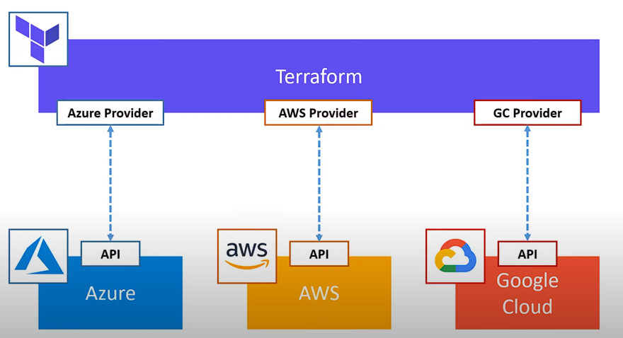

# DevopsWorkflow

# Infrastructure

# docker commands

<ul>
<li>docker build -t kensama101/weatherapi .</li>
<li>docker run -p 8080:80 kensama101/weatherapi</li>
<li>docker push kensama101/weatherapi</li>
</ul>

# Terraform

